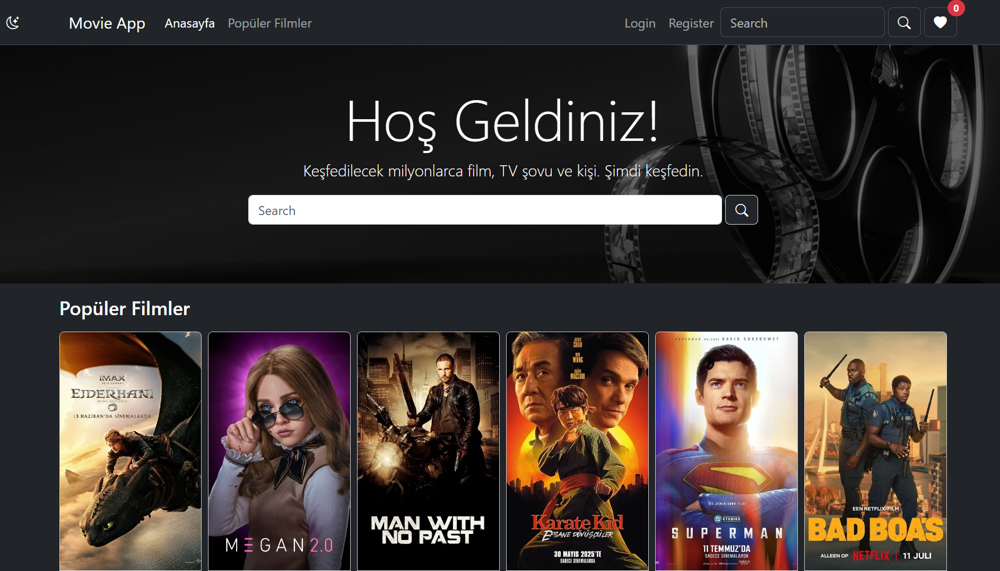
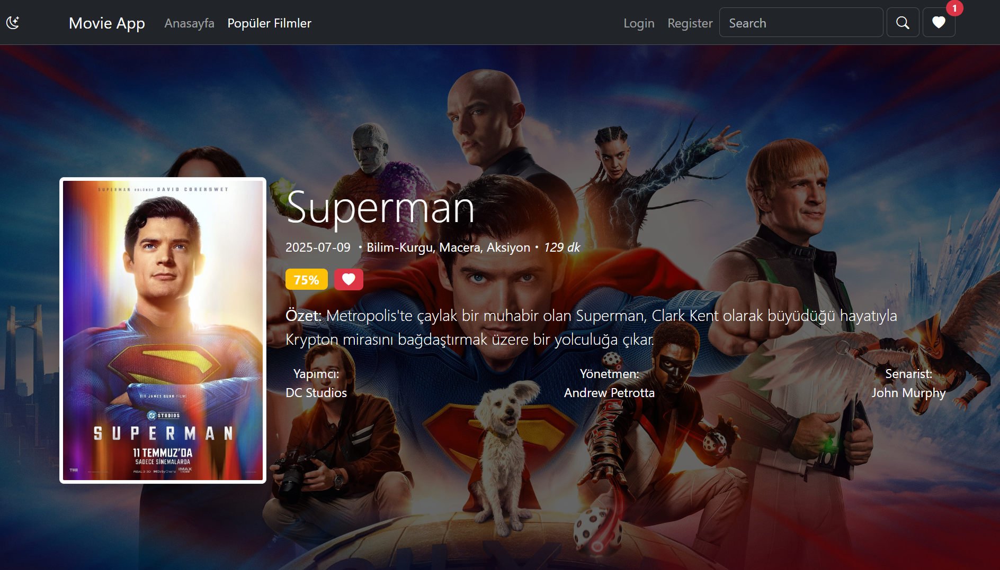

# MovieApp

MovieApp, React ve Bootstrap kullanılarak geliştirilmiş, TheMovieDB API’si üzerinden film araması yapabileceğiniz ve detaylı film bilgilerine ulaşabileceğiniz modern bir web uygulamasıdır.

## Özellikler

- Popüler filmleri ana sayfada görüntüleme  
- Film araması yapabilme  
- Seçilen filmin detay sayfasında; oyuncular, yapım tarihi, ülkesi, çıkış tarihi ve benzer filmler gibi kapsamlı bilgiler  
- Beğenilen filmler listesine film ekleyip çıkarabilme  
- Responsive ve kullanıcı dostu arayüz (Bootstrap ile tasarlandı)  
- Global Context API kullanımı ile uygulama genelinde yönetim  
- React Hooks ve validation kontrolleri ile dinamik ve güvenilir kullanıcı deneyimi  
- Modern layout ve bileşen yapısı  

## Teknolojiler

- React (Functional Components, Hooks)
- Vite (hızlı geliştirme ortamı) 
- Bootstrap  
- TheMovieDB API  
- Context API

## Ekran Görüntüleri

  
_Ana sayfa görüntüsü_

  
_Film detayları sayfası_  

## Kurulum ve Çalıştırma

1. Depoyu klonlayın:  
   ```bash
   git clone https://github.com/MuhammedMustafaDemirhan/MovieApp.git
   
2. Proje klasörüne girin:
   cd MovieApp

3. Gerekli bağımlılıkları yükleyin:
   npm install

4. .env dosyası oluşturun ve içine API anahtarınızı ekleyin
  VITE_TMDB_API_KEY=your_api_key_here

5. Uygulamayı başlatın:
   npm run dev

## İletişim

Her türlü soru, öneri veya geri bildirim için benimle iletişime geçebilirsiniz:

- **E-posta:** [muhammedmustafademirhan@gmail.com](mailto:muhammedmustafademirhan@gmail.com)
- **LinkedIn:** [linkedin.com/in/muhammedmustafademirhan](https://www.linkedin.com/in/muhammedmustafademirhan/)  
- **Instagram:** [instagram.com/mami.dmrhn](https://www.instagram.com/mami.dmrhn/)
